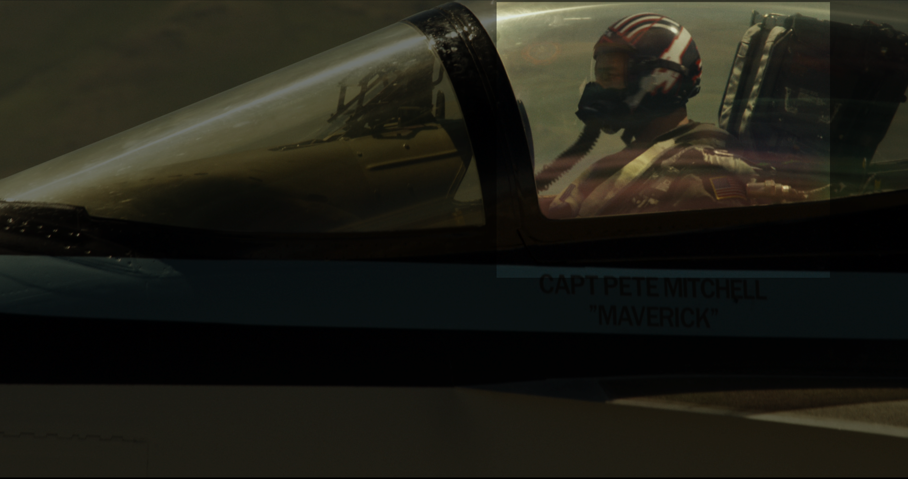
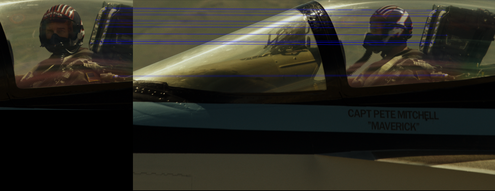

# LW2

## Задание
- 1. Реализовать программу согласно описанию. Можно использовать языки 
C++ или Python и любые библиотеки, при этом необходимо чтобы вся
задача не решалась только с помощью одной встроенной функции 
(например, lib.detect_template(image, template).
- 2. Сравнить качество работы двух вариантов реализации по точности 
детектирования.
- 3. Сделать отчёт в виде readme на GitHub, там же должен быть выложен 
исходный код.

## Теоретическая база
Template matching — метод, основанный на нахождении места на изображении, наиболее похожем на шаблон. 
“Похожесть” изображения задается определенной метрикой. В данном случае SQDIFF - сумма квадратов разниц значений пикселей
То есть, шаблон "накладывается" на изображение, и считается расхождение между изображением и шаблоном.
Положение шаблона, при котором это расхождение будет минимальным, и будет означать место искомого объекта.

В качестве метрики можно использовать разные варианты, например — сумма квадратов разниц между шаблоном и картинкой 
(sum of squared differences, SSD), или использовать кросс-корреляцию (cross-correlation, CCORR). 
Пусть f и g — изображение и шаблон размерами (k, l) и (m, n) соответственно (каналы цвета пока будем игнорировать);
i,j — позиция на изображении, к которой мы "приложили" шаблон.

Масштабно-инвариантная трансформация признаков (англ. scale-invariant feature transform, SIFT) - метод выявления
локальных признаков и сравнения точек интереса исходного изобрадения с новым. Ключевые точки - экстремумы разности гауссианов

## Результат работы
В ходе работы изображения были обработаны с помощью template matching (в качестве метрики использовался кавадрат разности) и SIFT.
Обработанные изображения представлены в директории examples

| experiment | static | SIFT |                                                                                   Комментарий |
|------------|:------:|-----:|----------------------------------------------------------------------------------------------:|
| top_gun    |   +    |    + |                                                            Минимальная разница в изображениях |
| bottom_gun |   +    |    + |                                              SIFT показал смещение объектов относительно фона |
| cup        |   +    |    - |                                                              SIFT все напутал из-за контраста |
| dice       |   +    |   +- |                                                            SIFT странно выбрал точки интереса |
| rat        |   +    |   +- |                                                                                               |
| gow        |   +-   |    - |                                           template matching нашел силуэт (хоть и неправильно) |
| tattoo     |   -    |   +- |                                                         SIFT правильно нашел 3 точки интереса |
| droid      |   -    |    + |                                         template matching не сработал из-за разного освещения |
| angle      |   +    |    + | template matching сработал, SIFT разбежался в разные стороны из-за того что очки симметричные |
| light      |   +-   |    + |                                                                                               |

## Источники мои источники
- https://docs.opencv.org/4.x/ - доки
- Brunelli, Template Matching Techniques in Computer Vision: Theory and Practice, Wiley ISBN 978-0-470-51706-2, 2009
- David G. Lowe. Object recognition from local scale-invariant features // Proceedings of the International Conference on Computer Vision