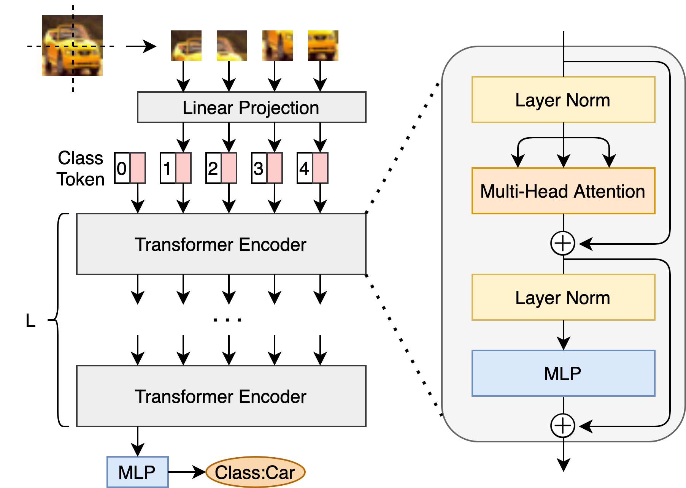
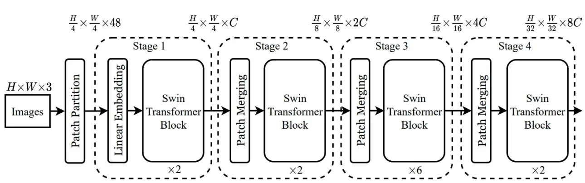
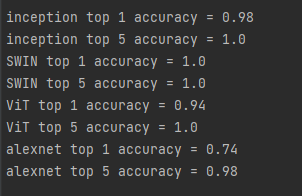

# LW2

## Задание
1. Реализовать систему классификации согласно описанию, используя не 
менее трех различных архитектур нейронной сети.
2. Сравнить качество работы, скорость и количество потребляемой памяти 
для каждой архитектуры.
3. Сделать отчёт в виде readme на GitHub, там же должен быть выложен 
исходный код.

## Модели
### AlexNet (2012) - 60M параметров
Дедушка AlexNet, в свое время самая быстрая рука на диком западе. ReLU

### Inception (2015) - 25М параметров
Разделение на модули и вспомогательные класификаторы for the win

### ViT (2020) - 300М параметров
Ранний трансформер для комп зрения. 
 

### SWIN (2021) - 50М параметров
Трансформер быстрее (и точнее)

## Результат
На 50 песиках нейронные сети показали следующие результаты:

 
ViT ошибся 3 раза, inception - 1 раз. В остальном почти идеальные показатели у всех сетей кроме AlexNet

По времени наблюдались следующие показатели

| Сеть          | AlexNet | Inception | SWIN   | ViT    |
|---------------|---------|-----------|--------|--------|
| Время на кадр | 0.02 c  | 0.11 c    | 0.18 c | 0.24 c |

Трансформеры не уступают традиционным сетям в точности, хоть и работают медленнее

## Сорсы
- https://pytorch.org/vision/stable/models.html
- https://arxiv.org/abs/2103.14030 - SWIN paper
- Szegedy, Christian (2015). "Going deeper with convolutions"
